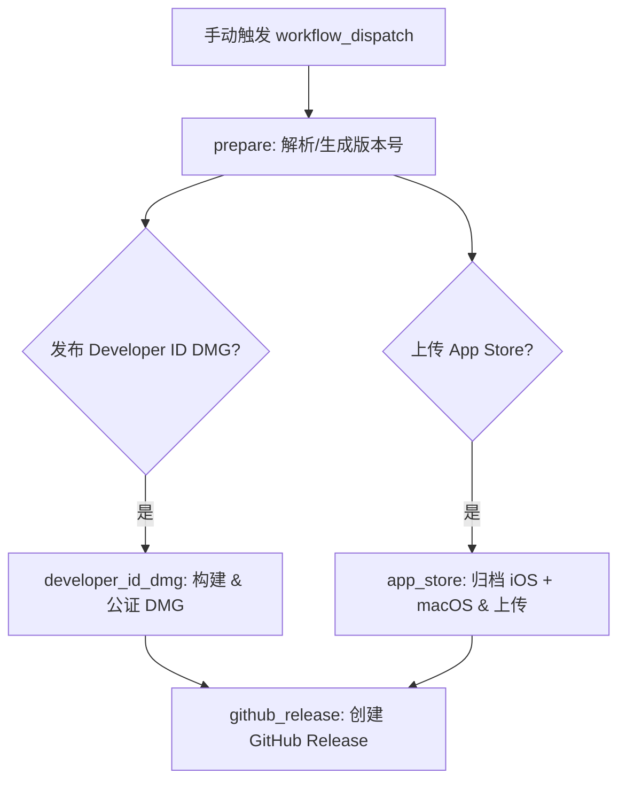

# Release 发布指南

## 概述

本项目通过 GitHub Actions 的 `release.yml` 工作流实现自动化发布。发布内容包含：

- **Developer ID DMG**（`CleverVpnEx.app`）：经过公证的 macOS 独立安装包
- **App Store Connect 上传**：iOS（`.ipa`）和 macOS（`.pkg`）双平台构建包

## 前置条件：更新依赖版本

当 `clever-vpn-kit` 版本发生变化时，需要先更新依赖版本配置文件，然后再触发发布。

### 1. 修改 DependencyVersions.env

编辑 `Config/DependencyVersions.env`，将 `CLEVER_VPN_KIT_VERSION` 更新为新的版本号：

```env
CLEVER_VPN_KIT_VERSION=2.1.3
```

> **说明**：发布工作流中的 `sync_clever_vpn_kit_version.sh` 脚本会读取此文件，自动更新 `project.pbxproj` 中的 SPM 依赖版本并刷新 `Package.resolved`。因此只需修改这一个文件即可。

### 2. 提交并合并到 main

```bash
git checkout -b chore/update-clever-vpn-kit-<version>
# 修改 Config/DependencyVersions.env
git add Config/DependencyVersions.env
git commit -m "chore: bump clever-vpn-kit to <version>"
git push origin chore/update-clever-vpn-kit-<version>
# 创建 PR 并合并到 main
```

## 触发发布

发布工作流仅允许在 `main` 分支上手动触发。

### 通过 GitHub Web UI 触发

1. 打开仓库的 **Actions** 页面
2. 左侧选择 **Release Apple Apps** 工作流
3. 点击 **Run workflow** 按钮
4. 填写参数：
   - **version**（可选）：指定版本号，如 `1.3.3` 或 `1.3.3-rc.1`。留空则自动从最新 release 递增 patch 版本。
   - **publish_developer_id**：是否构建并公证 Developer ID DMG（默认 `true`）
   - **publish_app_store**：是否归档并上传到 App Store Connect（默认 `true`）
5. 点击 **Run workflow**

### 版本号规则

| 格式 | 说明 | 是否预发布 |
|------|------|-----------|
| `1.3.3` | 正式发布版本 | 否 |
| `1.3.3-rc.1` | Release Candidate（预发布） | 是 |

如果留空 version，工作流会自动从 GitHub 最新 release tag 递增 patch 版本（例如 `v1.3.2` → `v1.3.3`）。

## 工作流执行流程



### 各阶段说明

1. **prepare**：校验 main 分支，验证密钥配置，归一化版本号，计算 App Store build number
2. **developer_id_dmg**：macOS 构建 → 公证 DMG → 上传为 artifact
3. **app_store**：iOS + macOS 双平台 archive → 导出 → 上传到 App Store Connect
4. **github_release**：创建/更新 Git tag（`v` 前缀）→ 创建 GitHub Release（附带 DMG 附件）

## 发布后

1. **GitHub Release**：可在仓库的 Releases 页面查看，正式版标记为 `Latest`，RC 版标记为 `Pre-release`
2. **App Store Connect**：上传后需在 App Store Connect 中完成 TestFlight 分发或提审
3. **DMG**：Developer ID 版本可直接分发给用户安装测试

## 需要的密钥/配置

| 配置项 | 来源 | 用途 |
|--------|------|------|
| `Config/Developer.xcconfig` | 仓库文件 | 开发者团队 ID、App ID 等 |
| `Config/DependencyVersions.env` | 仓库文件 | clever-vpn-kit 版本 |
| Bitwarden Secrets Manager | GitHub Secrets | 签名证书、API 密钥等 |
| App Store Connect API Key | Bitwarden | 公证 & 上传 |

## 故障排查

- **工作流不允许在非 main 分支运行**：确保已合并到 `main` 再触发
- **签名失败**：检查 Bitwarden Secrets 中的证书是否过期
- **版本号格式错误**：只支持 `x.y.z` 或 `x.y.z-rc.n` 格式
- **依赖版本未生效**：检查 `Config/DependencyVersions.env` 是否已正确更新并合并到 main
